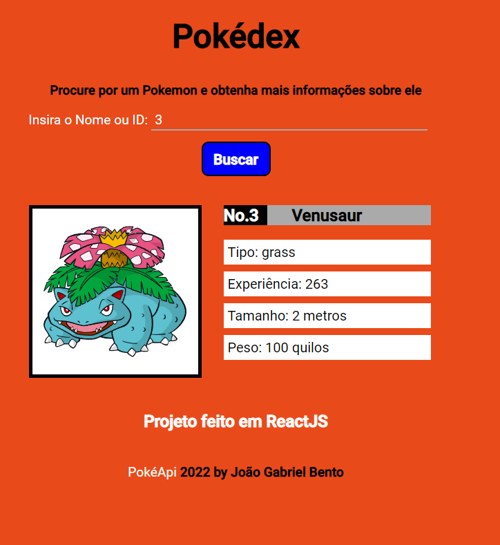

## Pokédex 

O pokédex é uma aplicação que facilita a busca de informações sobre um pokemon
usando o nome ou id do pokemon.

#### Informações retornadas:
    id do pokemon
    Foto do pokemon
    Tipo do pokemon
    Altura
    Peso
    Experiência

#### Consumo de API

A API de consumo foi a PokéAPI https://pokeapi.co/ e por meio do
Fetch as insformações são trazidas para a aplicação feita em ReactJS.
